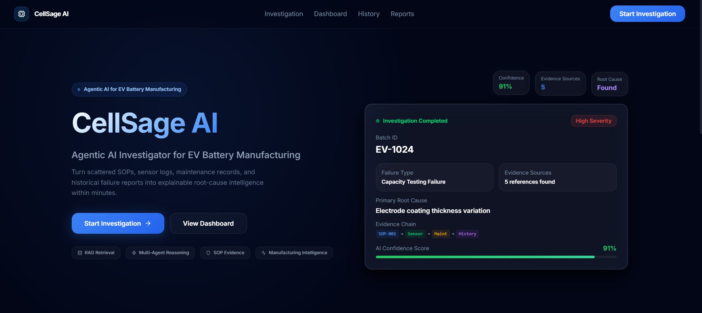
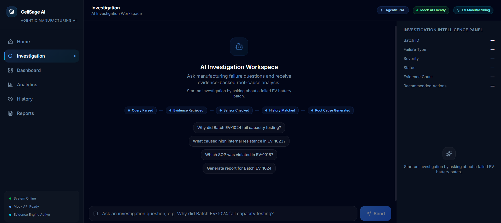
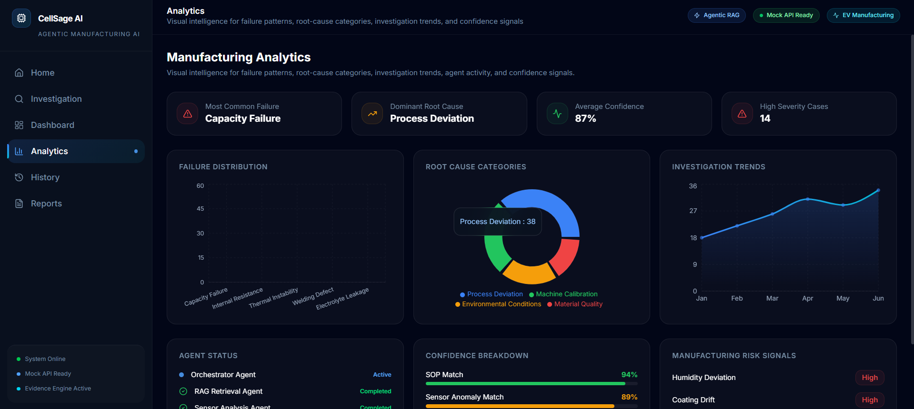
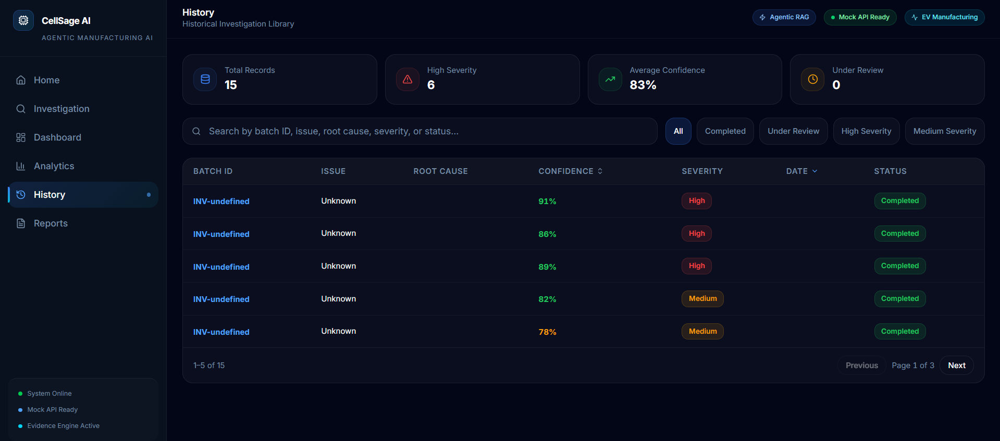

# CellSage AI: Agentic Copilot for EV Battery Manufacturing Root Cause Analysis

CellSage AI is an Agentic AI-powered manufacturing intelligence platform designed to accelerate Root Cause Analysis (RCA) in EV battery production environments.

By combining Retrieval-Augmented Generation (RAG), multi-agent orchestration, and manufacturing knowledge retrieval, CellSage AI enables engineers to investigate quality failures, identify probable root causes, generate corrective actions, and produce structured investigation reports within minutes.

Built for modern battery manufacturing facilities, CellSage AI transforms fragmented operational data into actionable manufacturing intelligence.

---

## Problem Statement

EV battery manufacturing generates large volumes of operational data across:

* Standard Operating Procedures (SOPs)
* Sensor Logs
* Maintenance Records
* Historical Failure Reports
* Quality Inspection Documents

Investigating production failures requires engineers to manually correlate information across multiple systems, resulting in:

* Slow Root Cause Analysis
* Increased Downtime
* Higher Scrap Rates
* Reduced Production Efficiency

CellSage AI addresses this challenge through autonomous evidence retrieval and agent-driven investigation workflows.

---

## Key Features

### Multi-Agent Investigation Pipeline

Specialized AI agents collaborate to perform end-to-end failure investigations.

* Retrieval Agent
* Sensor Analysis Agent
* Root Cause Agent
* Recommendation Agent

### Retrieval-Augmented Generation (RAG)

Relevant manufacturing documents are retrieved from a vector database before reasoning occurs.

### Root Cause Analysis

Automatically identifies probable manufacturing defects, process deviations, and equipment anomalies.

### Corrective Action Recommendations

Generates actionable remediation steps for operators and quality engineers.

### Investigation History

Stores previous investigations for traceability and auditing.

### Automated Report Generation

Produces structured investigation reports containing findings, evidence, and recommendations.

---

## System Architecture

```text
User
│
▼
React Frontend
│
▼
FastAPI Backend
│
▼
LangGraph Orchestrator
│
├── Retrieval Agent
├── Sensor Analysis Agent
├── Root Cause Agent
└── Recommendation Agent
│
├── ChromaDB Vector Database
├── Groq LLM
└── SQLite Database
│
▼
Investigation Report
```

---

## Technology Stack

### Frontend

* React
* TypeScript
* Vite
* Tailwind CSS
* Axios

### Backend

* FastAPI
* Python
* LangGraph
* LangChain

### AI & Data Layer

* Groq LLM
* ChromaDB
* SQLite

### Knowledge Sources

* SOP Documents
* Maintenance Records
* Sensor Logs
* Historical Failure Reports

---

## Multi-Agent Workflow

### 1. Issue Submission

The user submits a manufacturing failure or quality issue.

### 2. Evidence Retrieval

The Retrieval Agent queries ChromaDB and retrieves relevant manufacturing documents.

### 3. Sensor Analysis

The Sensor Agent analyzes operational signals and detects anomalies.

### 4. Root Cause Reasoning

The Root Cause Agent synthesizes evidence and generates probable causes.

### 5. Recommendation Generation

The Recommendation Agent proposes corrective and preventive actions.

### 6. Report Creation

A structured investigation report is generated and stored.

---

## API Endpoints

### Investigate Failure

```http
POST /investigate
```

Example Request:

```json
{
  "query": "Why did Batch EV-1024 fail capacity testing?"
}
```

### Retrieve Documents

```http
POST /retrieve
```

### Generate Report

```http
POST /report
```

### Investigation History

```http
GET /history
```

### Health Check

```http
GET /health
```

---

## Project Structure

```text
CellSageAI/
│
├── frontend/
│   ├── src/
│   ├── components/
│   ├── pages/
│   ├── services/
│   └── assets/
│
├── backend/
│   ├── agents/
│   ├── api/
│   ├── database/
│   ├── services/
│   ├── rag/
│   └── main.py
│
├── screenshots/
├── docs/
└── README.md
```

---

## Local Setup

### Clone Repository

```bash
git clone https://github.com/your-username/CellSageAI.git
cd CellSageAI
```

### Backend Setup

```bash
cd backend

pip install -r requirements.txt

py -m uvicorn main:app --reload
```

Backend runs on:

```text
http://localhost:8000
```

### Frontend Setup

```bash
cd frontend

npm install

npm run dev
```

Frontend runs on:

```text
http://localhost:5173
```

---

## Future Roadmap

* Real-time IoT integration
* Predictive maintenance models
* MES / ERP integration
* Multi-factory deployment
* Advanced anomaly detection
* Manufacturing digital twins

## Screenshots









Built for The Arch: RAG & Agentic AI Hackathon 2026

Transforming battery manufacturing investigations through Agentic AI.
